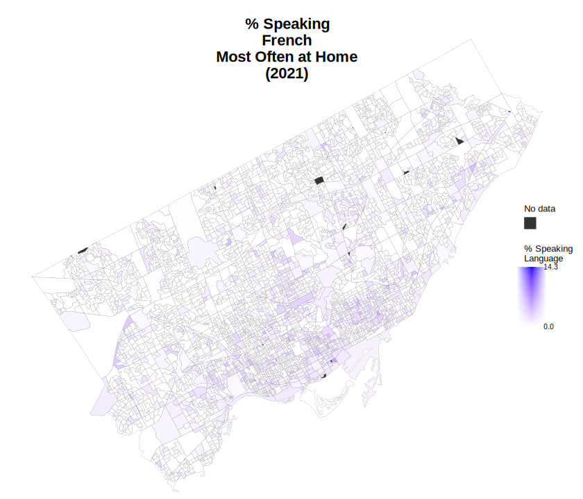
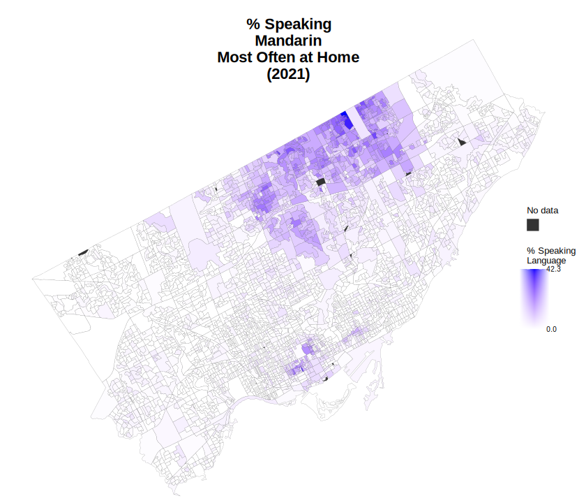

# Canada Census Investigation II
An investigation into non-official languages in Canada

## Project I: Shiny App of Non-English(/French) Language Communities 
# Visit the app 

### Screenshots

## Project II: Toronto-specific Language Communities

          
       
